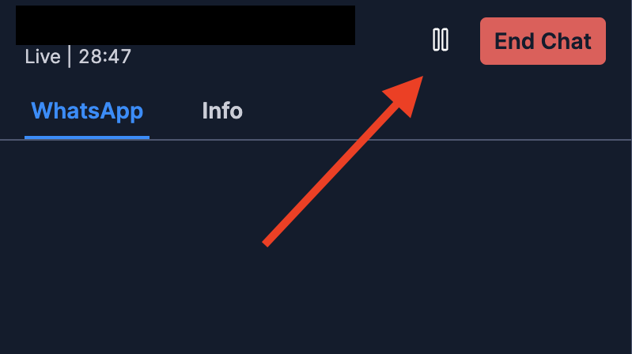

# Twilio Flex Conversations Park an Interaction Plugin

## Disclaimer

**This software is to be considered "sample code", a Type B Deliverable, and is delivered "as-is" to the user. Twilio bears no responsibility to support the use or implementation of this software.**

## Important note

To use this plugin you need to have Flex Conversations enabled on your account as well as Flex UI 2.0. Please read our doc for more details about it: https://www.twilio.com/docs/flex/developer/conversations

## Information about the plugin

This plugin is based in the instructions given on our doc on how to [Park an Interaction](https://www.twilio.com/docs/flex/developer/conversations/park-an-interaction). In the legacy Flex this functionality was known as "long-lived channels", but with the new Flex Conversations this feature needs to be built - hence the need for this plugin.

It adds a pause button in the chat so the conversation history is not lost. Next time the customer writes a message, if the chat was paused, the history of the conversation will be present.



## Customization

You may need a different use case then what this plugin does today. For example, currently when the customer writes a message, the task is routed to the specific workflow you added in the .env file. If you need to route back to a specific agent, you can simply change the unpark-an-interaction serverless function accordingly ([details for this example here](https://www.twilio.com/docs/flex/developer/conversations/park-an-interaction#add-a-specific-agent-back-to-the-interaction)).

## Setup

### Twilio Serverless Functions

This plugin includes a service used to park/unpark/close the interactions using Twilio Functions. Make sure you have the [Twilio Serverless Toolkit](https://www.twilio.com/docs/labs/serverless-toolkit/getting-started) installed before proceding.

- After installing it correctly, follow the procedure below:

```bash
cd serverless-park-an-interaction
```

```bash
cp .env.example .env
```

- Fill the `.env` file accordingly:

| Config&nbsp;Value         | Description                                                                                                                                                                                                                                                                                                |
| :------------------------ | :--------------------------------------------------------------------------------------------------------------------------------------------------------------------------------------------------------------------------------------------------------------------------------------------------------- |
| TWILIO_NUMBER             | Your Twilio Phone Number used for Flex. Add in E.164 format. Ex.: +551143214321.                                                                                                                                                                                                                           |
| WORKSPACE_SID             | TaskRouter Workspace identifier. Obtainable in the console under TaskRouter > Workspaces. Starts with WSxxxx.                                                                                                                                                                                              |
| CONVERSATIONS_WEBHOOK_URL | This you will need to add AFTER deploying your Twilio Serveless Functions. Once deployed, in your console under Functions and Assets > Services, click in the corresponding service. Inside you will see a function `/unpark-an-interaction`. Click on it, then click on Copy URL and paste it in the .env |

- Run

```bash
twilio serverless:deploy
```

#### \*DO NOT FORGET

- After the first deploy, you need to add the CONVERSATIONS_WEBHOOK_URL and run the `twilio serverless:deploy` command once again.

### Plugin

- First install the dependencies in the plugin's folder and create the `.env` file:

```bash
# If you are inside the serverless folder, first run: cd ..
cd plugin-park-an-interaction

# If you use npm
npm install

# Create the .env according to the example
cp .env.example .env
```

- Fill the `.env` file with the URLs of your Twilio functions created earlier `/park-an-interaction` and `/close-an-interaction` respectively.

- Inside the `/public` folder, create a `appConfig.js` file according to the `appConfig.example.js` file.

- Go to the `constants.js` file (inside src > utils) and change the URLs .

- Finally, to deploy the plugin, run:

```bash
twilio flex:plugins:deploy --changelog "WRITE YOUR CHANGELOG HERE"
```

- You can also run the plugin locally for testing purposes:

```bash
twilio flex:plugins:start
```

### Kudos

Special thanks to [Aymen Naim](https://github.com/aymenn) for the thoughtful insights and assist on building this plugin.
